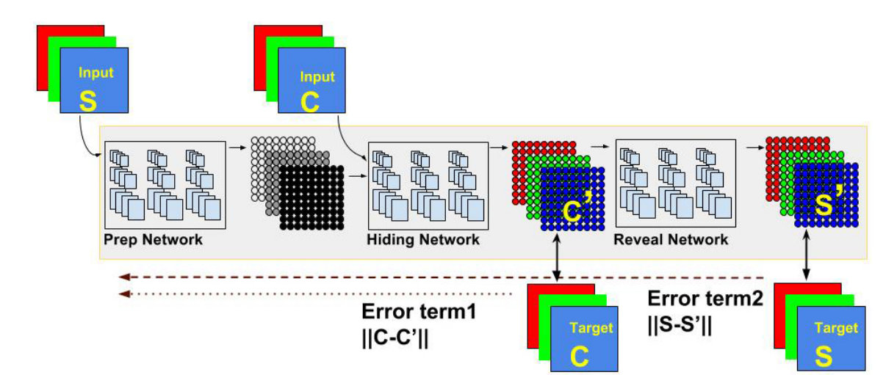
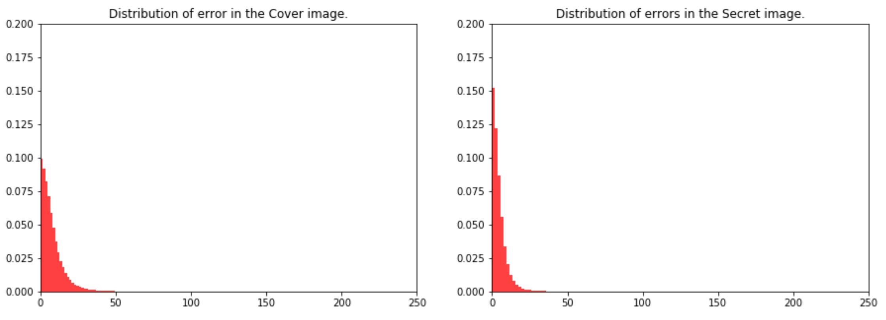
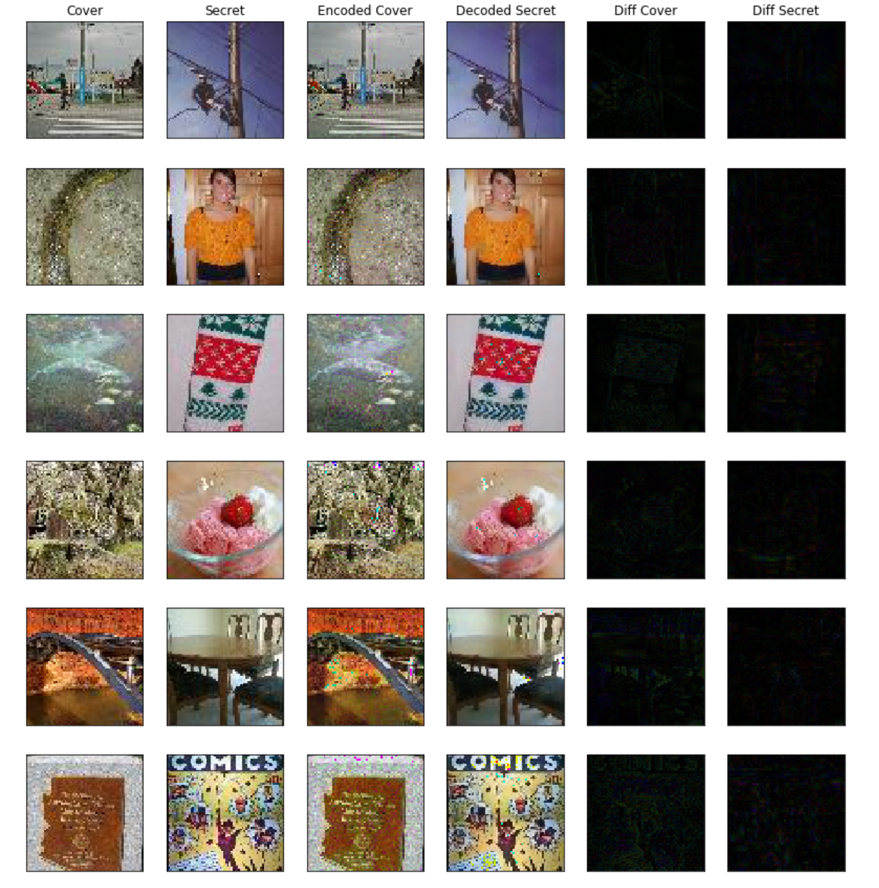

# Deep Steganography

## Instalation
The required dependencies are:
- Tensorflow
- Keras
- tqdm

## Introduction

This is an open-source implementation of the paper **Hiding Images in Plain Sight: Deep Steganography, by Shumeet Baluja (Google), at NIPS 2017**. The paper is available [here](https://papers.nips.cc/paper/6802-hiding-images-in-plain-sight-deep-steganography).

This code was initially produced with the goal of reproducing to a reasonable degree the results achieved and described in the paper, for the **[Global NIPS Paper Implementation Challenge](https://nurture.ai/nips-challenge/)**.

**Abstract**: Steganography is the practice of concealing a secret message within another, ordinary, message. Commonly, steganography is used to unobtrusively hide a small message within the noisy regions of a larger image. In this study, we attempt to place a full size color image within another image of the same size. Deep neural networks are simultaneously trained to create the hiding and revealing processes and are designed to specifically work as a pair. The system is trained on images drawn randomly from the ImageNet database, and works well on natural images from a wide variety of sources. Beyond demonstrating the successful application of deep learning to hiding images, we carefully examine how the result is achieved and explore extensions. Unlike many popular steganographic methods that encode the secret message within the least significant bits of the carrier image, our approach compresses and distributes the secret image's representation across all of the available bits.

## Dataset

The dataset we used in this implementation is Tiny ImageNet Visual Recognition Challenge. It can be downloaded from [here](https://tiny-imagenet.herokuapp.com/) and extracted to data/. The following figure shows some sample images of the dataset.

## Architecture and implementation

The model is composed of three parts: The **Preparation Network**, **Hiding Network** (Encoder) and the **Reveal Network**. Its goal is to be able to encode information about the secret image S into the cover image C, generating C' that closely resembles C, while still being able to decode information from C' to generate the decoded secret image S', which should resemble S as closely as possible.

The Preparation Network has the responsibility of preparing data from the secret image to be concatenated with the cover image and fed to the Hiding Network. The Hiding Network than transforms that input into the encoded cover image C'. Finally, the Reveal Network decodes the secret image S' from C'. For stability, we add noise before the Reveal Network, as suggested by the paper. Although the author of the paper didn't originally specify the architecture of the three networks, we discovered aggregated layers showed good results. For both the Hiding and Reveal networks, we use 5 layers of 65 filters (50 3x3 filters, 10 4x4 filters and 5 5x5 filters). For the Preparation Network, we use only 2 layers with the same structure.

Note that the loss function for the Reveal Network is different from the loss function for the Preparation and Hiding Networks. In order to correctly implement the updates for the weights in the networks, we create stacked Keras models, one for the Preparation and Hiding Network (which share the same loss function) and one for the Reveal Network. To make sure weights are updated only once, we freeze the weights on the layers of the Reveal Network before adding it to the full model.

Although the author of the paper didn't explicitly described the learning rate schedule or the optimizer properties, we used our own schedule with ADAM optimizer. We train for 1000 epochs with a batch size of 32.

## Results

The following figure shows the distribution pixel-wise distribution of errors for the cover and secret images, respectively. Note that the errors are in a 0-255 scale.

Finally, we show some examples of the generated images compared to the real ones. The 5th and 6th columns show the magnified differences between the generated cover and secret images.

